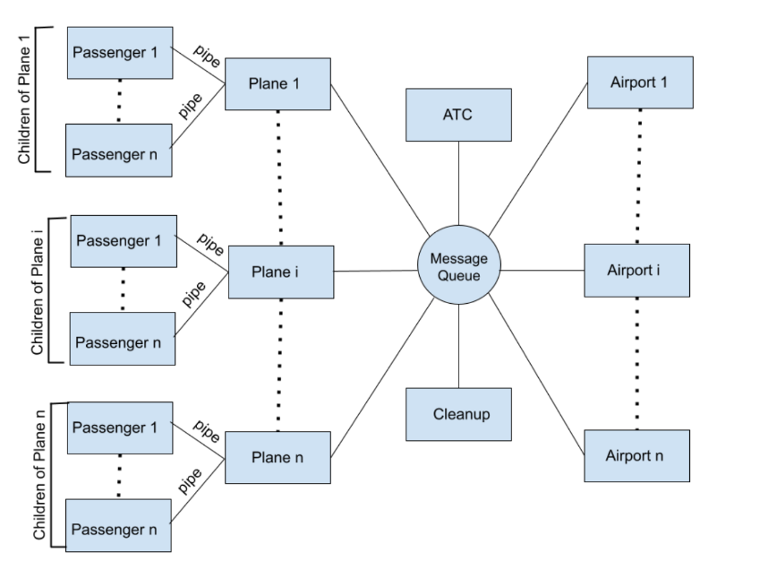

# Air Traffic Control System – Operating Systems Simulation

This project is a simulation of an **Air Traffic Control System**, built as part of a university Operating Systems course. It models a complex, concurrent environment using low-level OS primitives and demonstrates mastery of **process control**, **inter-process communication**, and **synchronization** in a real-time, multi-process system.

---

## ✈️ Overview

The system simulates air traffic across multiple airports by coordinating the following entities:

- **Planes**
  - Two types: **Passenger planes** and **Cargo planes**, both take structured user input at runtime.
  - Passenger planes create child processes to represent individual passengers and use **pipes** for communication.
  - Cargo planes take input for the number and average weight of cargo items.
- **Airports** (multi-threaded processes)
  - Handle both arrivals and departures concurrently using threads.
  - Each airport has multiple **runways** with different weight capacities.
  - Runways are allocated to planes using a **best-fit** algorithm.
  - **Mutexes** are used to synchronize thread access to runways and prevent conflicts.
- **Air Traffic Controller (ATC)**
  - Coordinates all communication through a **single POSIX message queue**.
  - Logs each flight's journey to a central log file.
- **Cleanup Process**
  - Handles system-wide termination when triggered by user input.
  - Signals the Air Traffic Controller, which initiates shutdown by instructing airports to terminate once all planes have landed.
  - Ensures proper cleanup of IPC mechanisms like message queues.

The simulation includes realistic constraints such as runway availability, boarding/unloading durations, and asynchronous plane journeys. Passenger and cargo data are collected dynamically during runtime, and system coordination is entirely message-driven.

*System architecture showing process hierarchy and communication mechanisms*

---
## 🚀 Features

- Simulates plane operations occurring concurrently across multiple airports.
- Models both passenger and cargo planes with real-time user input and behavior.
- Dynamically spawns child processes for passengers, capturing weight details via **pipes**.
- Allocates runways using a best-fit strategy, with automatic fallback to a backup runway if needed.
- Uses **threads** at each airport to handle multiple departures and arrivals simultaneously, with synchronization implemented using **mutexes**.
- Centralized Air Traffic Controller (ATC) coordinates all messaging through a single **POSIX message queue**.
- Tracks each flight's journey and logs it to a structured log file.
- Supports safe, user-triggered shutdown after all flights are completed.

---

## 🔧 Build & Run

The system is implemented in **C** and is fully **POSIX-compliant**. It is designed to be compiled and executed on Linux systems (tested on Ubuntu 22.04) using `gcc` with `-pthread` support for multithreading.

Each component (plane, airport, controller, cleanup) is compiled independently and executed in separate terminal instances.

> This project is not intended for deployment but demonstrates low-level systems programming concepts in an academic simulation.

---

## 📄 Notes

The repository includes the full problem statement and system specification: 
**[OS Assignment PDF](./OS%20Assignment%202%20-%20Air%20Traffic%20Control%20System.pdf)**

This document outlines the design constraints, entity behaviors, and communication rules. However, aspects such as communication mapping, message structure, and synchronization logic (e.g., runway handling via mutexes) were independently designed.

---

